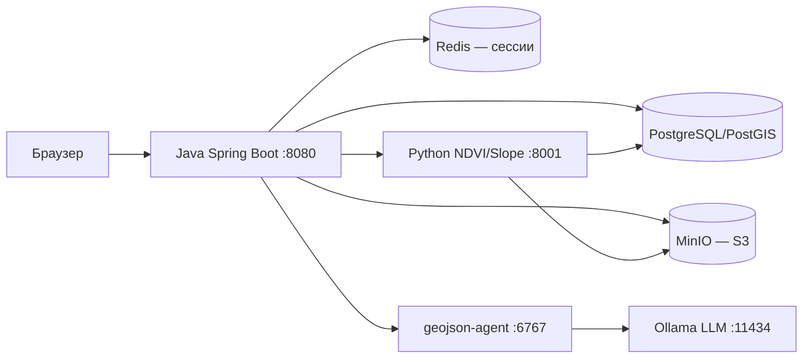

Диплом
# GeoFields (Агроситуация)

Веб-платформа для управления сельскохозяйственными полями организации: интерактивная карта, NDVI/уклон/рельеф, севооборот, полевые операции, отчёты и администрирование пользователей.

## Архитектура



Браузер обращается только к Java-бэкенду. NDVI, уклон и рельеф идут по цепочке **front → Java proxy → Python**. Импорт shapefile — **front → Java → geojson-agent (ИИ-маппинг полей) → Java**.

| Компонент | Назначение |
|-----------|------------|
| `geoFields/` | Spring Boot 4, Thymeleaf, REST API, прокси к Python и geojson-agent |
| `python-service/` | FastAPI: NDVI-тайлы, тренды, уклон, рельеф (SRTM), работа с `.tif` и S3 |
| `geojson-agent/` | Конвертация shapefile → GeoJSON с LLM-маппингом атрибутов |
| `sql/` | Миграции Flyway |
| `shared-data/` | Локальное хранилище сцен и тайлов для Python (монтируется в контейнер) |
| `LAST_BCUP_BD.sql` | Дамп БД, восстанавливается при первом старте Postgres |

## Стек

- **Backend:** Java 21, Spring Boot, Spring Security, JDBC, Redis Session
- **БД:** PostgreSQL 17 + PostGIS
- **Кэш/сессии:** Redis 7
- **Объектное хранилище:** MinIO (S3 API)
- **Аналитика:** Python 3.11, FastAPI, rasterio, rio-tiler, SQLAlchemy
- **ИИ-импорт:** Ollama (`qwen2.5:14b`), geojson-agent
- **Фронтенд:** Thymeleaf, MapLibre GL, vanilla JS

## Быстрый старт (Docker)

### Требования

- Docker и Docker Compose
- Для `ollama` / `geojson-agent`: NVIDIA GPU (опционально; без GPU закомментируйте блок `gpus` / `deploy` у сервиса `ollama` в `docker-compose.yml`)

### Сборка JAR и запуск

```bash
cd geoFields
./gradlew clean bootJar    # Windows: gradlew.bat clean bootJar
cd ..

docker compose up -d --build
```

Приложение: **http://localhost:8080**

Полный сброс данных (включая БД из бэкапа):

```bash
docker compose down -v
docker compose up -d --build
```

`docker compose down -v` удаляет volumes. При следующем старте Postgres заново восстановит `LAST_BCUP_BD.sql`, Flyway применит миграции из `sql/`, `scene-indexer` проиндексирует `.tif` из `shared-data`.

### Порты сервисов

| Сервис | Порт | Описание |
|--------|------|----------|
| `app` | 8080 | Основное веб-приложение |
| `db` | 5434 → 5432 | PostgreSQL/PostGIS |
| `redis` | 6379 | Сессии |
| `python-processor` | 8001 → 8000 | NDVI / slope / elevation API |
| `minio` | 9000 (API), 9001 (консоль) | S3-хранилище |
| `geojson-agent` | 6767 | Импорт shapefile |
| `ollama` | 11434 | LLM для geojson-agent |

Учётные данные MinIO по умолчанию: `minioadmin` / `minioadmin`.

## Локальная разработка (без Docker)

Требования: Java 21, локальные PostgreSQL (с PostGIS) и Redis.

Настройки по умолчанию — `geoFields/src/main/resources/application.properties`:

- БД: `jdbc:postgresql://localhost:5432/geofields`, пользователь `postgres`, пароль `12345`
- Redis: `localhost:6379`
- Python-сервис: `http://localhost:8001`
- geojson-agent: `http://localhost:6767`

```bash
cd geoFields
./gradlew bootRun
```

Для полного контура аналитики и импорта дополнительно поднимите Python, MinIO и (при необходимости) geojson-agent — см. `docker-compose.yml`.

## Режим live-ui (редактирование HTML/CSS/JS)

В `docker-compose.yml` по умолчанию `SPRING_PROFILES_ACTIVE: live-ui`. Шаблоны и статика монтируются из:

- `geoFields/src/main/resources/templates/`
- `geoFields/src/main/resources/static/`

После изменений достаточно перезапустить контейнер приложения:

```bash
docker compose restart app
```

Чтобы брать UI только из JAR, установите `SPRING_PROFILES_ACTIVE: ""` и пересоберите JAR (`./gradlew clean bootJar`).

## Роли и тестовые пользователи

Пароль для всех: **`user1234`**

| Логин | Роль |
|-------|------|
| `user123` | `ORG_MANAGER` — заявки на регистрацию, приглашения |
| `user12345` | `AGRONOMIST` — севооборот, поля, полевые операции |
| `user1234` | `ORG_ADMIN` — пользователи организации, удаление полей |
| `2user1234` | `ORG_ADMIN` |
| `2user12345` | `USER` — просмотр карты, отчётов, операций |

Вход: **http://localhost:8080/about** (форма логина).

## Основные возможности

### Карта (`/`)

- Поля организации в GeoJSON, пересечения полей
- Слои NDVI, уклона и рельефа по дате
- График тренда NDVI за диапазон дат
- Импорт полей из shapefile (агроном / админ)

### Страницы по ролям

| URL | Доступ | Назначение |
|-----|--------|------------|
| `/org/manager` | менеджер, админ | Заявки, приглашения |
| `/org/admin` | админ | Участники, роли, удаление полей |
| `/org/agronomist` | агроном, админ | История посевов, статусы полей |
| `/org/field-work` | агроном, админ | Полевые операции |
| `/org/reports` | все роли организации | Сводные отчёты |

## API

Полные схемы запросов и ответов:

| Файл | Содержание |
|------|------------|
| `geoFields/src/main/resources/static/OpenAPIspec.yaml` | Основной HTTP API бэкенда |
| `geoFields/src/main/resources/static/ndvi-outbound-api.yaml` | Контракт Java → Python (NDVI) |
| `geoFields/src/main/resources/static/slope-outbound-api.yaml` | Контракт Java → Python (уклон) |
| `geoFields/src/main/resources/static/elevation-outbound-api.yaml` | Контракт Java → Python (рельеф) |
| `geoFields/src/main/resources/static/shapefile-import-api.yaml` | Импорт shapefile |

### Ключевые эндпоинты

- `GET /api/session/context` — контекст сессии, роль, CSRF для UI
- `GET /get_fields`, `GET /api/fields/{fieldId}/intersections` — поля и пересечения (GeoJSON)
- `GET /get_ndvi_value`, `/get_ndvi_by_id`, `/get_all_ndvi_tile` — NDVI (точка, поле, организация)
- `GET /get_ndvi_tiles_for_field`, `/get_ndvi_trend`, `/tiles/{field_id}/...` — NDVI через Python-прокси
- `GET /get_slope_tiles_for_field`, `/get_slope_trend`, `/slope/tiles/...` — уклон
- `GET /prepare_elevation/{field_id}`, `/tiles/elevation/...`, `/tiles/slope/...` — рельеф
- `POST /api/fields/import`, `POST /api/fields/import/commit` — импорт shapefile
- `/api/org/manager/*` — менеджер организации
- `/api/org/admin/*` — администрирование
- `/api/org/agronomist/*` — агроном (история культур, intake полей, статусы)
- `/api/field-work/*` — полевые операции
- `GET /api/reports/dashboard` — отчёты

### Авторизация и CSRF

- Сессия: cookie `JSESSIONID` (Spring Security, Redis)
- Для `POST`/`PUT`/`DELETE`: cookie `XSRF-TOKEN` + заголовок `X-XSRF-TOKEN`
- CSRF-токен: `GET /api/session/context` или cookie после любого запроса к приложению

**Postman / внешний клиент:** авторизуйтесь через форму логина, скопируйте `JSESSIONID` и `XSRF-TOKEN` из cookie браузера (DevTools → Application → Cookies) или получите CSRF из `/api/session/context`.

## Структура репозитория

```
.
├── geoFields/              # Java-приложение (Spring Boot)
│   └── src/main/
│       ├── java/           # контроллеры, сервисы, репозитории
│       └── resources/
│           ├── templates/  # HTML (Thymeleaf)
│           └── static/     # CSS, JS, OpenAPI-спецификации
├── python-service/         # NDVI, slope, elevation (FastAPI)
├── geojson-agent/          # shapefile → GeoJSON + LLM
├── sql/                    # Flyway-миграции
├── docker/                 # init-скрипты (Postgres, Ollama)
├── shared-data/            # сцены и кэш для Python (не в git)
├── docker-compose.yml
└── LAST_BCUP_BD.sql        # начальный дамп БД
```

## Полезные команды

```bash
# Логи приложения
docker compose logs -f app

# Пересборка только Python-сервиса
docker compose up -d --build python-processor

# Тесты Java
cd geoFields && ./gradlew test
```

## Переменные окружения

Основные блоки в `docker-compose.yml`:

- `x-app-environment` — Spring: БД, Redis, URL Python/geojson-agent, S3
- `x-python-environment` — Python: `DATABASE_URL`, `GEE_*` (Google Earth Engine, опционально), S3
- `x-geojson-agent-environment` — Ollama URL и имя модели

Для продакшена замените пароли БД, Redis, MinIO и вынесите секреты в `.env` (файл не коммитится).
